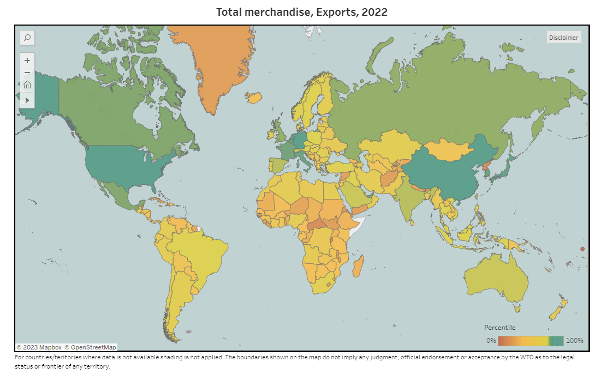

```{r setup, include=FALSE}
# Set knitr options
knitr::opts_chunk$set()
# Load required packages
suppressPackageStartupMessages(library(tidyverse))
suppressPackageStartupMessages(library(infer))
suppressPackageStartupMessages(library(modelr))
suppressPackageStartupMessages(library(broom))
suppressPackageStartupMessages(library(tidyr))
suppressPackageStartupMessages(library(knitr))
suppressPackageStartupMessages(library(tinytex))
suppressPackageStartupMessages(library(shiny))
# Read in demographics
global_slavery <- read.csv('Global_Slavery_Index.csv')
global_transplants <- read.csv('GODT_Global_Kidney_Transplant.csv')
poverty_gap <- read.csv('OECD_Poverty_Gap.csv')
poverty_rate <- read.csv('OECD_Poverty_Rate.csv')
organized_crime <- read.csv('Organized_Crime_Index.csv')
surgeon_workforce <- read.csv('Surgeon_Workforce.csv')
gini_index <- read.csv('WB_Gini_Index.csv')
working_poverty <- read.csv('Working_POverty_ILO.csv')

# Read in Formal Supply Chain Data
sexcountry <- read.csv("ILO_inflows_sexcountry.csv")
edu <- read.csv("ILO_education.csv")
outdest <- read.csv("ILO_outflow_destination.csv")
outwork <- read.csv("ILO_outside_workforce.csv")
skill <- read.csv("ILO_skill_level.csv")
trade_agreements <- readxl::read_xlsx("ILO_trade_agreements.xlsx")
unemploy <- read.csv("ILO_unemployment.csv")
WB_FDI <- read.csv("WB_FDI.csv")
OECD_FDI <- readxl::read_xlsx("OECD_FDI.xlsx")
UNCTAD_trade <- read.csv("UNCTAD_trade.csv")
# Read in Informal Supply Chain Data

```

# Introduction

This week we have added onto our demographics data, cleaned our formal/informal supply chain data, and did more qualitative research on kidney trafficking. Below we have listed our newly cleaned data, the additions to demographics, and our qualitative research. 

# Demographic Data

[WHO Global Health Workforce Statistics Database](https://www.who.int/data/gho/data/themes/topics/health-workforce)

Lots of data on healthcare workers around the world from the World Health Organization. Not very specific to surgeons and urologists though. 

[2022 Urologists in America](https://www.auanet.org/research-and-data/data-and-statistical-services/data-sources)

We were only able to find urologists in the United States by year. We can collect more data on different years if need be. 

# Migration Data

The following data includes new data collect this week, but also some cleaned data sets from last week. We also have included numerous datasets from various databases that need to be confirmed on whether they are needed for the study. 

### [Interactive World Migration Report 2022](https://worldmigrationreport.iom.int/wmr-2022-interactive/)

Graphics on international labor migration. Includes time series on movement restrictions (internal and international). Includes other bigger graphs not translatable for a screenshot.
```{r}


```
[WTO Stats](https://stats.wto.org/dashboard/merchandise_en.html)
```{r}

```

### Labor migration
The following is the cleaned dataset for the various ILO labor migration datasets.

**Inflow of working age foreign citizens by sex and country of citizenship**

The data on the inflow of working-age foreign citizens allows us to identify regions or countries that are more likely to be sources of potential kidney donors.

```{r, echo=FALSE, results='asis'}
cat('<div style="margin-top: 10px;"><input type="checkbox" style="vertical-align: middle;"> <strong>include?</strong></div><br>')
```

**Inflow of worker-age population by education and sex**

Data on education level of incoming working migrants. This level of data might be useful to see patterns on education and kidney divulgence within the scope of the project. Includes all levels of education, which provides high utility.

```{r, echo=FALSE, results='asis'}
cat('<div style="margin-top: 10px;"><input type="checkbox" style="vertical-align: middle;"> <strong>include?</strong></div><br>')
```

**Inflow of employed foreign-born by occupation**

Shows country of destination and national’s homestate.

```{r, echo=FALSE, results='asis'}
cat('<div style="margin-top: 10px;"><input type="checkbox" style="vertical-align: middle;"> <strong>include?</strong></div><br>')
```

**Outflow of nationals**

Data on the number of people working and living outside of society might be useful for predicting which and how many groups of people might be susceptible to organ trafficking.

```{r, echo=FALSE, results='asis'}
cat('<div style="margin-top: 10px;"><input type="checkbox" style="vertical-align: middle;"> <strong>include?</strong></div><br>')
```

**Persons outside the workforce**

Data on the number of people working and living outside of society might be useful for predicting which and how many groups of people might be susceptible to organ trafficking.

```{r, echo=FALSE, results='asis'}
cat('<div style="margin-top: 10px;"><input type="checkbox" style="vertical-align: middle;"> <strong>include?</strong></div><br>')
```

**Unemployment % sex, education, citizenship**
```{r}
print(colnames(unemploy))
```

Unemployment data might be indicative of possible susceptible populations. It can show domestic workforce strength, which might influence worker reliance on donating kidneys. 

```{r, echo=FALSE, results='asis'}
cat('<div style="margin-top: 10px;"><input type="checkbox" style="vertical-align: middle;"> <strong>include?</strong></div><br>')
```

**Trade agreement dataset**
```{r}
print(colnames(trade_agreements))
```

Labor provisions in trade agreements.

```{r, echo=FALSE, results='asis'}
cat('<div style="margin-top: 10px;"><input type="checkbox" style="vertical-align: middle;"> <strong>include?</strong></div><br>')
```

### [WTO I-TIP Services Indictars](https://i-tip.wto.org/services/docs/indicators.pdf)

Many of the service indicators could also be indicators of labor migration or workers who have to work abroad. We were not able to find the data on this but if we do more searching on the website we might be able to find it. 

```{r, echo=FALSE, results='asis'}
cat('<div style="margin-top: 10px;"><input type="checkbox" style="vertical-align: middle;"> <strong>include?</strong></div><br>')
```

### [Eurostat Database](https://ec.europa.eu/eurostat/en/web/main/data/database)

If you go to detailed **datasets > international trade > international trade** in services, you can find a lot of international services trade that can build upon the WTO I-TIP services. Also, if you go to selected **datasets > population and social conditions > migration**, you can find some EU migration data as well. There’s also a children in migration section under the cross cutting topics folder.

```{r, echo=FALSE, results='asis'}
cat('<div style="margin-top: 10px;"><input type="checkbox" style="vertical-align: middle;"> <strong>include?</strong></div><br>')
```

# International Trade Data

### [Internationa Trade Data OECD](https://www.oecd-ilibrary.org/trade/international-trade/indicator-group/english_20cce8d6-en)

Includes data on trade in goods and services (and the forecasting of said items); current account balance(and forecast); exports by business size; terms; domestic value in gross exports

### [International Monetary Fund Data Page](https://data.imf.org/?sk=388dfa60-1d26-4ade-b505-a05a558d9a42&sid=1479329132316)

The following are different datasets from the IMF that might be useful for the study:

[Balance of Payments](https://data.imf.org/?sk=7a51304b-6426-40c0-83dd-ca473ca1fd52)
The balance of payments is a statistical statement that summarizes transactions between residents and nonresidents during a period. It consists of the goods and services account, the primary income account, the secondary income account, the capital account, and the financial account. File is too big to attach to this document.
```{r, echo=FALSE, results='asis'}
cat('<div style="margin-top: 10px;"><input type="checkbox" style="vertical-align: middle;"> <strong>include?</strong></div><br>')
```

[Commodity Terms of Trade](https://data.imf.org/?sk=2cddccb8-0b59-43e9-b6a0-59210d5605d2)
Country-specific commodity price indices, including export, import, and terms-of-trade indices. For each country, the change in the international price of up to 45 individual commodities is weighted using commodity-level trade data. Coverage includes 182 countries. Goes back to 1980.
```{r, echo=FALSE, results='asis'}
cat('<div style="margin-top: 10px;"><input type="checkbox" style="vertical-align: middle;"> <strong>include?</strong></div><br>')
```

[Consumer Price Index (CPI)](https://data.imf.org/?sk=4ffb52b2-3653-409a-b471-d47b46d904b5)
Index numbers that measure changes in the prices of goods and services purchased or otherwise acquired by households, which households use directly, or indirectly, to satisfy their own needs and wants.This data was collected by the IMF and OECD.
```{r, echo=FALSE, results='asis'}
cat('<div style="margin-top: 10px;"><input type="checkbox" style="vertical-align: middle;"> <strong>include?</strong></div><br>')
```

[Coordinated Direct Investment Survey(CDIS)](https://data.imf.org/?sk=40313609-F037-48C1-84B1-E1F1CE54D6D5)
The CDIS database presents detailed data on "inward" direct investment positions (i.e., direct investment into the reporting economy) cross-classified by economy of immediate investor, and data on "outward" direct investment positions (i.e., direct investment abroad by the reporting economy) cross-classified by economy of immediate investment. 
```{r, echo=FALSE, results='asis'}
cat('<div style="margin-top: 10px;"><input type="checkbox" style="vertical-align: middle;"> <strong>include?</strong></div><br>')
```

[Coordinated Portfolio Investment Survey (CPIS)](https://data.imf.org/?sk=B981B4E3-4E58-467E-9B90-9DE0C3367363)
The CPIS is a voluntary data collection exercise conducted under the auspices of the IMF. An economy provides data on its holdings of portfolio investment securities (data are separately requested for equity and investment fund shares, long-term debt intruments, and short-term debt instruments).
```{r, echo=FALSE, results='asis'}
cat('<div style="margin-top: 10px;"><input type="checkbox" style="vertical-align: middle;"> <strong>include?</strong></div><br>')
```

[Direction of Trade Statistics (DOTS)](https://data.imf.org/?sk=9d6028d4-f14a-464c-a2f2-59b2cd424b85)
DOTS presents the value of merchandise exports and imports disaggregated according to a country's primary trading partners. Area and world aggregates are includes in the display of trade flows between major areas of the world. Reported data is supplemented by estimates whenever such data is not available or current. 
```{r, echo=FALSE, results='asis'}
cat('<div style="margin-top: 10px;"><input type="checkbox" style="vertical-align: middle;"> <strong>include?</strong></div><br>')
```

[Export Diversification and Quality](https://data.imf.org/?sk=a093df7d-e0b8-4913-80e0-a07cf90b44db)
Includes time series information. 
```{r, echo=FALSE, results='asis'}
cat('<div style="margin-top: 10px;"><input type="checkbox" style="vertical-align: middle;"> <strong>include?</strong></div><br>')
```

[Financial Access Survey (FAS)](https://data.imf.org/?sk=388dfa60-1d26-4ade-b505-a05a558d9a42&sid=1479329132316)
Cibtaubs 180 time series and 65 indicators that are expressed as rations to GDPp, land area, or adult population to facilitate cross-economy comparisons. Provision of FAS data is voluntary.
```{r, echo=FALSE, results='asis'}
cat('<div style="margin-top: 10px;"><input type="checkbox" style="vertical-align: middle;"> <strong>include?</strong></div><br>')
```

### [International Trade Indicators: Mechandise Trade](https://wits.worldbank.org/country-indicator.aspx)
Website contains a vast amount of sheets. Later verification is needed.

[Total Tariff Lines](https://wits.worldbank.org/CountryProfile/en/country/by-country/startyear/LTST/endyear/LTST/tradeFlow/Import/indicator/AHS-TTL-TRFF-LNS/partner/WLD/product/Total)

A dataset that contains information about the total number of tariff lines for specific products categorized using the Harmonized System, and this data is presented by country, providing insights into the tariff treatment of various goods in international trade.

```{r, echo=FALSE, results='asis'}
cat('<div style="margin-top: 10px;"><input type="checkbox" style="vertical-align: middle;"> <strong>include?</strong></div><br>')
```

### UNCTAD Relative Price of Exports to Imports

[Trade indicators - UNCTAD Handbook of Statistics 2022](https://hbs.unctad.org/trade-indicators/)
```{r}
print(colnames(UNCTAD_trade))
```

```{r, echo=FALSE, results='asis'}
cat('<div style="margin-top: 10px;"><input type="checkbox" style="vertical-align: middle;"> <strong>include?</strong></div><br>')
```

# Foregin Direct Investments (FDI)

### World Bank FDI Dataset
```{r}
WB_FDI2 <- pivot_longer(WB_FDI, starts_with("x"), 
                        names_to = "year",
                        values_to = "value")
print(colnames(WB_FDI2))
```

```{r, echo=FALSE, results='asis'}
cat('<div style="margin-top: 10px;"><input type="checkbox" style="vertical-align: middle;"> <strong>include?</strong></div><br>')
```

### OECD FDI Dataset

```{r}
print(colnames(OECD_FDI))
```

```{r, echo=FALSE, results='asis'}
cat('<div style="margin-top: 10px;"><input type="checkbox" style="vertical-align: middle;"> <strong>include?</strong></div><br>')
```

# More on Kidneys

[Human Trafficking for Organ Removal in India](http://cofs.org/home/wp-content/uploads/2012/06/COFS-India-Report-on-HTOR-on-15th-Feb-2014.pdf)

A study conducted by an NGO looked at organ trafficking victims in private hospitals. They estimate thousands are victims within India, and identified around 1,000 who claim they are victims, but they only interviewed around 153 victims. They did a medical follow up with 133 of these victims. 22% of cases occurred from 2009-2012.

```{r}


```

[UNODC Trafficking in Persons for the Purpose of Organ Removal](https://www.unodc.org/documents/human-trafficking/2015/UNODC_Assessment_Toolkit_TIP_for_the_Purpose_of_Organ_Removal.pdf)

Not really relevant directly to the research project, but this UNODC report (2015) is a UN report on organ removal and essentially the document focuses on creating an overview on what organ removal and trafficking is and looks like, with an ultimate recommendation to the reader on how to assess the response to trafficking and removal within a country through research and interviews.

[Kidney trafficking is "big business," says Council of Europe](https://www.ncbi.nlm.nih.gov/pmc/articles/PMC1323242/)

Information on kidney trafficking occurring in poorer areas of Europe, as seen in this passage: “Trafficking networks target poor European countries such as Estonia, Bulgaria, Turkey, Georgia, Russia, Romania, Moldova, and Ukraine, where people are pressured into selling their kidneys for as little as $2500 (£1550; €2200), the report said.”

[UC Berkeley Organs Watch](https://newsarchive.berkeley.edu/news/media/releases/99legacy/11-03-1999b.html)

Ongoing research at UC Berkeley on organ trafficking called organs watch. Organs Watch is an independent documentation center focusing on organ-related issues. The [professor](https://vcresearch.berkeley.edu/news/award-recognizes-impact-anthropologists-work-human-organs-trade) in charge got an award for her research in this area, though her work is hidden behind a paywall. 

[Convergence: What kidneys, cigarettes and rhino horn have in common --- on Global Initiatives for Organ Trafficking Archive](https://globalinitiative.net/analysis/what-kidneys-cigarettes-and-rhino-horn-have-in-common/)

This article mentions a Professor at GMU who works on illicit Rhino horn trade and it mentions kidney trafficking. She only uses it as a comparison, but what I found interesting was that she mentions that she discovers different types of networks. Maybe a person worth meeting with. 

[Information on Organ Trafficking in China](https://www.newyorker.com/news/news-desk/can-china-stop-organ-trafficking)

Points out that in China it could be state-sponsored organ trafficking or systematic trafficking of organs, since they are using the death row and inmates as a way to meet the demand for organ donors and to also curb illicit organ trade outside the government’s control. 

Nicholas Bequelin, a senior researcher with Human Rights Watch in Hong Kong, told me that “==the complete lack of transparency led to the emergence of a lucrative gray market, through which wealthy or politically connected individuals could source the organ needed for a transplant from scheduled executions==.” According to Bequelin, the booming organ business has, in turn, led to a situation “in which unscrupulous criminals have started sourcing organs themselves, either by buying organs from sellers or even, in some cases, kidnapping and harvesting organs from their victims.”

```{r}

```
